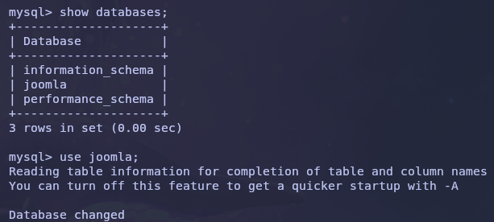

#abusing-sudo #apport-cli #cms  CVE-2023-1326, CVE-2023-23752, ffuf, hashcat, joomla, mysql, netcat, wfuzz


Devvortex es una máquina con un sistema Linux el cual debemos iniciar el ataque realizando fuerza bruta de subdominios para encontrar un subdominio que contiene un CMS vulnerable a un CVE. Esta vulnerabilidad nos permite obtener unas credenciales para acceder al panel de administrador del CMS y obtener una reverse shell que nos dará acceso al sistema objetivo. Una vez dentro debemos hacer un movimiento lateral hacia otro usuario del sistema mediante la recuperación y desencriptación de un hash que encontramos en la base de datos MYSQL que hay en el sistema. Finalmente, para conseguir la escalada de privilegios debemos de abusar de los permisos otorgados a un binario.

# **Reconocimiento**

## Nmap

El escaneo de puertos nos arroja la siguiente información:


Utilizando esta información, mi evaluación inicial es:

- Servicio **SSH** en el puerto 22 TCP. Puede ser útil en el futuro si se encuentran credenciales o se pueden generar claves después de obtener un punto de apoyo.

- Servicio **HTTP** alojado en el puerto 80 TCP corriendo bajo Nginx 1.18.0 con un redireccionamiento hacia http://devortex.htb. Se puede comprobar el sitio web y si no encontramos ninguna vulnerabilidad podemos enumerar subdirectorios y/o subdominios mediante fuerza bruta.

## Website (80 TCP Port)

Añadimos devortex.htb en el fichero /etc/hosts y accedemos a la dirección mediante el navegador:


Por el momento no vemos nada interesante.

## Fuerza bruta de directorios

Ahora es una buena opción intentar encontrar algún subdirectorio. Esto lo podemos hacer mediante alguna herramienta como **`ffuf`**:

![[../../../Imágenes/Pasted image 20240919134107.png]]

Los resultados tampoco nos muestran nada interesante.

## Fuerza bruta de subdominios

Ahora podemos realizar una fuerza bruta de subdominios con **wfuzz**:


Los resultados nos muestran la existencia de un subdominio: `**dev.devvortex.htb**`.

Añadimos el subdominio en el fichero /etc/hosts y navegamos hacia él para ver que nos encontramos:


Tampoco vemos nada interesante, pero sí vemos que es un sitio web desarrollado con Joomla:


## Fuerza bruta de directorios en subdominios

Ahora probemos a realizar fuerza bruta de directorios, pero esta vez en el subdominio descubierto:


Encontramos el panel de inicio de sesión en el directorio **administrator**:


# **Foothold**

## Joomla Version

Ahora sería interesante tratar de buscar la versión de Joomla para saber si existe una vulnerabilidad relacionada con dicha versión que podamos usar para ganar acceso al sistema objetivo.

Según este [sitio web](https://hackertarget.com/attacking-enumerating-joomla/), podemos intentar buscar la versión de Joomla en las siguientes direcciones:

- /administrator/manifests/files/joomla.xml
- /language/en-GB/en-GB.xml

![[../../../Imágenes/Pasted image 20240919134133.png]]

Con esta información podemos concretar que estamos enfrente de la versión 4.2.6.

## Identificar la vulnerabilidad

Buscando en Google encontramos que la versión de Joomla tiene una vulnerabilidad, [CVE-2023-23752](https://nvd.nist.gov/vuln/detail/CVE-2023-23752). Según NVD, esta versión de Joomla permite el acceso no autorizado a puntos finales del servicio web gracias a una comprobación de acceso incorrecta.


## Prueba de concepto

Esta vulnerabilidad es fácil de explotar utilizando este [exploit](https://www.exploit-db.com/exploits/51334). Descargamos el exploit y lo ejecutamos:

![[../../../Imágenes/Pasted image 20240919134147.png]]

Encontramos unas credenciales de la base de datos MYSQL.

Usando estas credenciales en el panel de administrador de Joomla conseguimos tener acceso al CMS.

## Explotación

Una vez dentro del sistema es muy fácil obtener acceso al sistema, solo tenemos que reemplazar un archivo de alguna plantilla del CMS, preparar un listener de **netcat** y navegar hacia ella:

![[../../../Imágenes/Pasted image 20240919134159.png]]

Una vez conseguimos el punto de apoyo en el sistema objetivo es buen momento para estabilizar la terminal e intentar buscar la bandera user.txt. En este caso hemos accedido al sistema como usuario www-data y no podemos leer la bandera que está en la carpeta del usuario Logan. Vamos a intentar hacer un movimiento lateral hacia el usuario Logan.


#  **Movimiento lateral**

En primer lugar, intentemos conectarnos a la base de datos MYSQL e intentar recopilar algún hash para desencriptarlo:


 

![[../../../Imágenes/Pasted image 20240919134217.png]]

![[../../../Imágenes/Pasted image 20240919134234.png]]

Estamos de suerte y encontramos el hash del usuario Logan:   
  
`$2y$10$IT4k5kmSGvHSO9d6M/1w0eYiB5Ne9XzArQRFJTGThNiy/yBtkIj12`

Intentemos desencriptarlo usando **hashcat:**

![[../../../Imágenes/Pasted image 20240919134303.png]]

Finalmente, podemos obtener acceso al sistema objetivo mediante **SSH** y como usuario Logan, el cual ya podemos leer la bandera user.txt:

![[../../../Imágenes/Pasted image 20240919134309.png]]

# **Escalada de privilegios**

## Identificar la vulnerabilidad

Comprobamos los permisos sudo sobre el usuario **Logan** y encontramos que puede ejecutar el binario **/usr/bin/apport-cli** con privilegios:


## Proof of Concept

Investigando en Google encontramos que el binario **apport-cli** tiene una vulnerabilidad llamada [CVE-2023-1326](https://nvd.nist.gov/vuln/detail/CVE-2023-1326):


La siguiente prueba de concepto nos puede proporcionar un terminal con privilegios root:

```
The apport-cli supports view a crash. These features invoke the default
pager, which is likely to be less, other functions may apply.

It can be used to break out from restricted environments by spawning an
interactive system shell. If the binary is allowed to run as superuser
by sudo, it does not drop the elevated privileges and may be used to
access the file system, escalate or maintain privileged access.

apport-cli should normally not be called with sudo or pkexec. In case it
is called via sudo or pkexec execute `sensible-pager` as the original
user to avoid privilege elevation.

Proof of concept:

$ sudo apport-cli -c /var/crash/xxx.crash
[...]
Please choose (S/E/V/K/I/C): v
!id
uid=0(root) gid=0(root) groups=0(root)
!done  (press RETURN)

This fixes [CVE-2023-1326](https://github.com/advisories/GHSA-qgrc-7333-5cgx "CVE-2023-1326").

Bug: [https://launchpad.net/bugs/2016023](https://launchpad.net/bugs/2016023)
Signed-off-by: Benjamin Drung <benjamin.drung@canonical.com>
```

#### Explotación

En primer lugar, para realizar la explotación de esta vulnerabilidad y obtener un terminal con privilegios debemos ejecutar la aplicación y seleccionar que queremos reportar un problema referente a la pantalla:

![[../../../Imágenes/Pasted image 20240919134413.png]]

Entonces, indicamos que tipo de problemas hemos observado, por ejemplo, podemos indicar que hemos observado congelaciones de la pantalla durante el arranque o el uso del sistema:

``

Ahora, debemos indicar que queremos ver el informe y una vez el binario nos muestre toda la información del informe nos aparecerán dos puntos (:).

``


En este momento debemos escribir el signo de exclamación (!) y pulsar la tecla Enter:

``

Con esto, conseguimos obtener el terminal con privilegios y leer la bandera root.txt:

```

```


